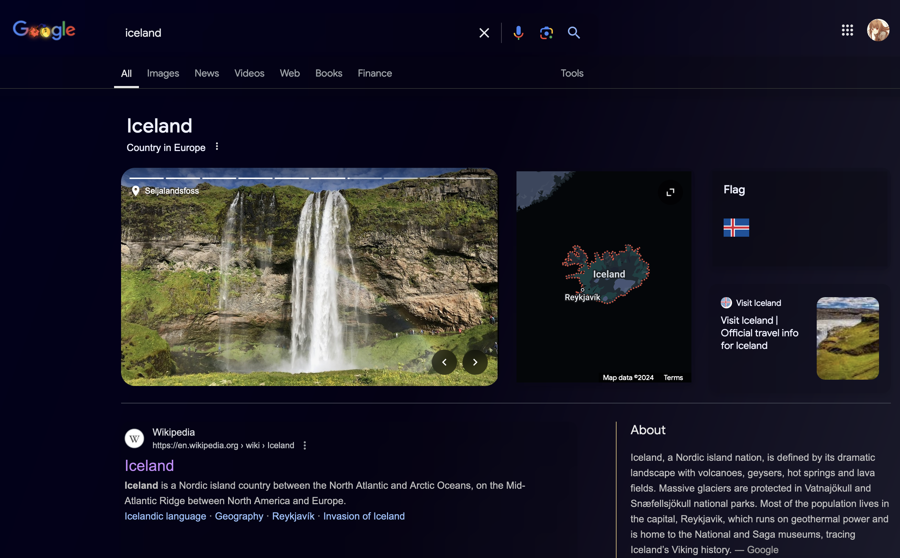
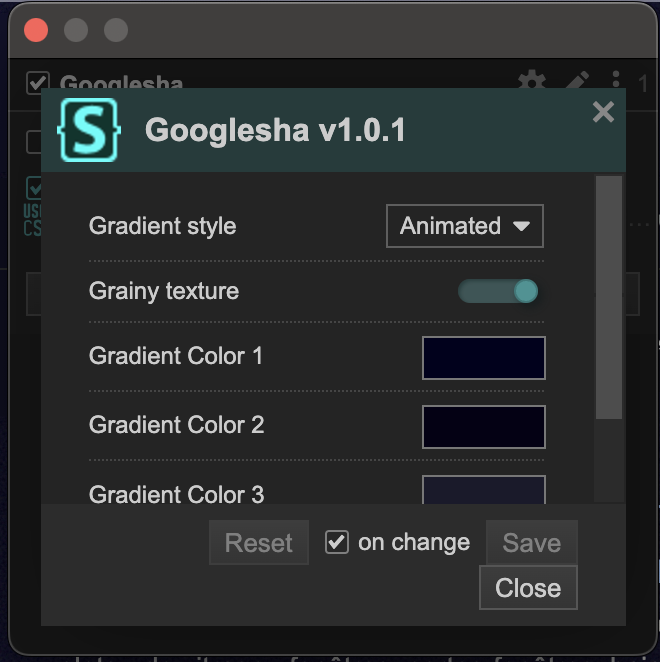
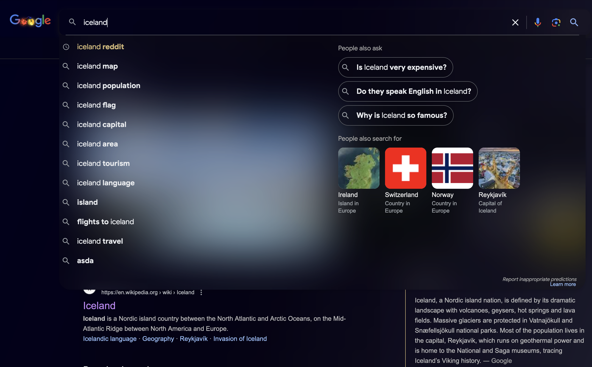
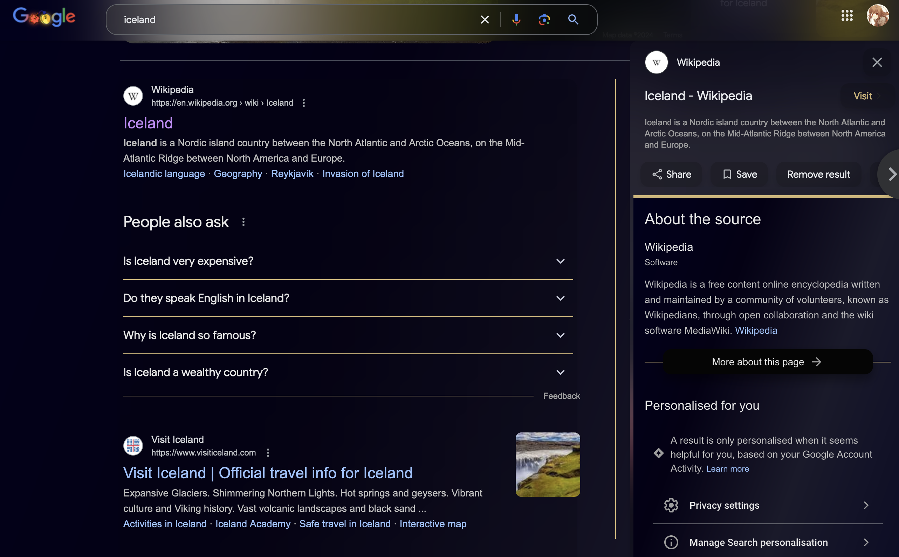

# Sensha's betterer google

    

This is the fifth in a - less and less short - series of ""design"" projects. 

## Visuals 

    

This google interface is prettier with acrylic elements and a dark theme. It also has an optional peek feature that lets the user glance at a webpage without leaving the cozyness of their original search page. 

    

If you do not like the gradient or if you are like me and you like changing colors all the time, you can change the colors directly through Stylus' options UI. It's pretty neat and instantaneous. I also added a toggle for the grainy texture and the background now comes with three options: 
- Animated gradient (default)
- Static gradient
- No gradient
  

    

## Installation 

    

Install the css using Stylus. You can get Stylus through the following links: 

-   [Firefox](https://addons.mozilla.org/en-US/firefox/addon/styl-us/)
-   [Chrome](https://chromewebstore.google.com/detail/stylus/clngdbkpkpeebahjckkjfobafhncgmne)

Once you have Stylus, you can install the theme directly clicking here: 

If you want **peek**, install the js script using whatever people use to manage userscripts. I used [ViolentMonkey](https://violentmonkey.github.io/) because that's what Fallen used. 

- Direct link to the peek functionality: 

## Credits 

- [Fallen](https://github.com/FallenStar08) - Always ❤️. Forgive me god cuz I stole code from you. But then again I forced you to write that code so I think we're even. 
- Peloton 

    

